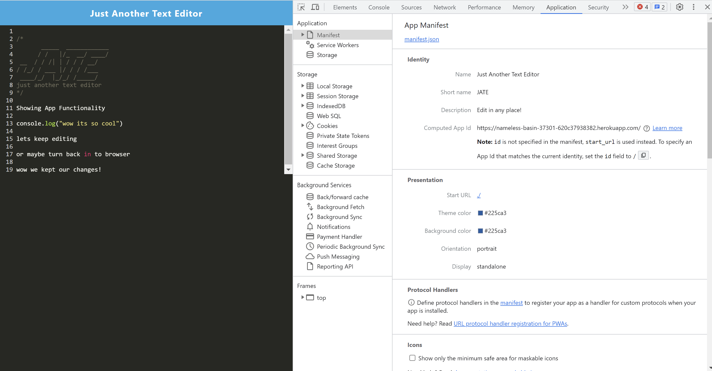
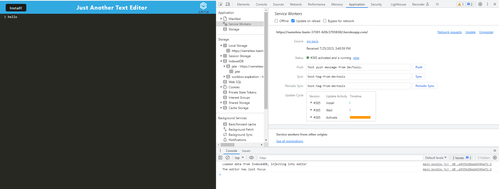
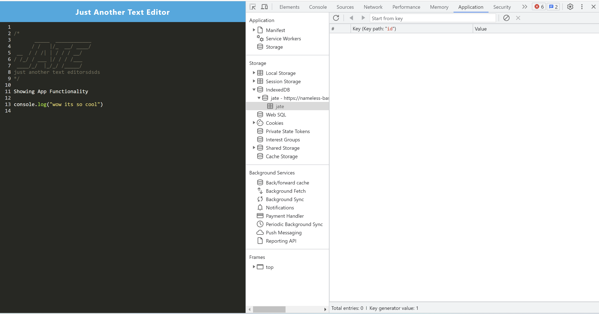

# Text-Editor

</img>

## Description

Text editor that runs in the browser. The app is a single-page application that meets the PWA criteria. Additionally, it feature a number of data persistence techniques that serve as redundancy in case one of the options is not supported by the browser. The application also function offline.

## User Story

```md
AS A developer
I WANT to create notes or code snippets with or without an internet connection
SO THAT I can reliably retrieve them for later use
```

## Mock-Up

The following animation demonstrates the application functionality:


The following image shows the application's `manifest.json` file:



The following image shows the application's registered service worker:



The following image shows the application's IndexedDB storage:




## License

This project utilizes an MIT License. [Read more](https://choosealicense.com/licenses/mit/)

## Links

Github: <br>
https://github.com/Alexslzr

App: <br>
https://nameless-basin-37301-620c37938382.herokuapp.com/
